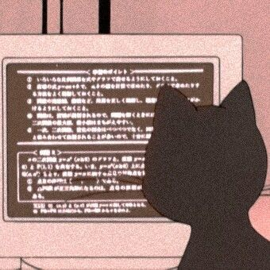
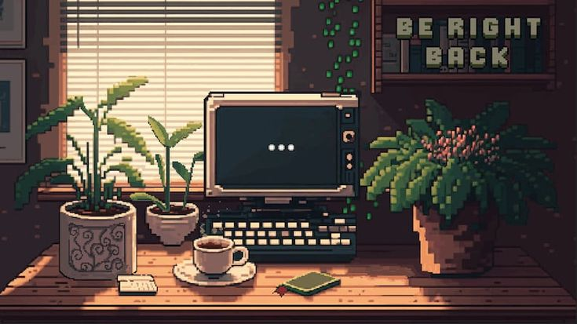

  <ul align="center">
    
<h3 style="display: inline-block">🌟"Perhaps there is a simple answer – not an easy answer – but simple"🌟 </h1>

    
## Olá, Seja bem vindo.. 💜💫

#### | Engenharia | Programação Backend | Python | Flask | Inovações Tecnologicas | 

  
👨‍💻 Saiba mais sobre mim 👨‍💻

  - 💬 Tenho 22 anos, moro em Minas Gerais e estou cursando o segundo ano da graduação em Engenharia de Software na UNOPAR(EAD). Faço trabalho voluntário no CREAJR-MG como assessora de documentos.

  - ⚡ Interesse em tecnologia, programação, música, escrita criativa e psicologia.

 

- 🔭 Estou a proucura da minha primeira oportunidade profissional.
- 🔭 Focada em desenvolver as habilidades requisitadas no mercado de trabalho. 

 

  <table>
    <tr>
      <td></td>
      <td></td>
      <td></td>
    </tr>
  </table>

 

 
   
## Tools i know ✔️☘️

 

 

  

#### "We could be typical, or we could take a break from this pipe dream;"

  

### Estou comprometida em aprimorar continuamente minhas habilidades e contribuir para a evolução da tecnologia. Vejo o aprendizado como um processo constante e enriquecedor, e busco desafios e oportunidades que promovam meu crescimento pessoal e profissional. ⭐✨

### Vamos explorar as infinitas possibilidades do mundo da tecnologia!💻🚀

##### Entre em contato comigo: fcinthia11@yahoo.com

